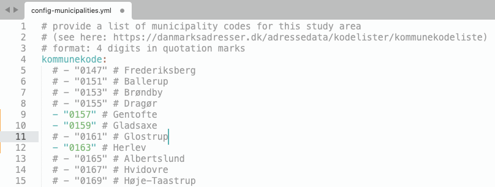

# Step 3: Provide information on your study area and user-defined evaluation layers

In this step, you can customize the input data generation by selecting whether to download elevation data (or provide your own); which municipalities to include in the analysis; which point/polygon data to include in the evaluation; and how to merge the data into broader evaluation categories.

You do so by editing the four `.yml` files in the config folder of this repository (`config.yml`, `config-municipalities.yml`, `config-layers-point.yml`, and `config-layers-polygon.yml`; explained in detail below). You can edit `.yml` in any standard text editor on your machine; then save your changes for them to take effect, before you continue to the next step.

## Settings for elevation data download (`config.yml`)

**If you don't have an elevation raster (DEM) for the study area:**

The workflow includes a script that downloads elevation data from [Dataforsyningen](https://dataforsyningen.dk/) upon request. To do so, provide your username (at `datafordeler_username`) and password (at `datafordeler_password`) to Dataforsyningen in the `config.yml` file. In the next step, make sure to set `download_elevation` to `1` when running the bash script ([Step 4](run-bashscript.md)).

**If you already have an elevation raster (DEM) for the study area:**

1. Complete [steps 1-4](https://github.com/anastassiavybornova/bike-node-planner-data-denmark/tree/main) of the instructions.
2. Make sure to set `download_elevation` to `0` when running the bash script ([Step 4](run-bashscript.md)).
3. Place your DEM file in the `/input-for-bike-node-planner/dem/` folder and name the file `dem.tif`.

## Which municipalities? (`config-municipalities.yml`)

For each municipality that you want to be included in the analysis, delete the leading `#` in front of the corresponding 4-digit code; then save the file. Make sure not to change the indentation. In the example below, the file is edited so that the 3 municipalities of Gentofte, Gladsaxe, and Herlev will be included in the analysis, while the rest of the municipalities (Frederiksberg, Ballerup, etc.) will be ignored.

## Which point layers? (`config-layers-point.yml`)

In the `config-layers-point.yml`, you will find a list of categories and subcategories of point data.

✅ You can customize how these subcategories are merged into separate evaluation layers by typing the corresponding evaluation layer name next to each subcategory name.

❓ An evaluation layer is a group of inputs that are used to evaluate the bicycle node network. For example, to avoid first evaluating how much of the network runs through forest, then how much runs through wetlands, etc. we can group these into one evaluation layer 'nature'.

✅ You can also choose subcategories to be excluded from the evaluation by typing `ignore` next to the subcategory name.

❌ Only the evalation layers or whether to ignore a subcategory should be changed (in black in the example below). The categories and subcategories (in green) reflect the available data and should not be modified.

*Note that the evaluation layer names are case-sensitive.*

In the example below, the main category is `facilit_indkoeb`:

* Within the main category facilit_indkoeb, we have the subcategories `supermarked`, `bager`, `kiosk`, etc. 
* These subcategories are added to two different user defined *evaluation layers*,  `shop` and `tourism`.
* The evaluation layer `shop` will include the subcategories `supermarked, bager, kiosk, slagter, fisk`. The evaluation layer `tourism` will include the subcategory `lokale smagsoplevelser`; and finally, the subcategory `tank` will be ignored.

<!-- 
## Which linestring layers? (`config-layers-linestring.yml`)

In the `config-layers-linestring.yml`, you will find a list of categories and subcategories of linestring data. You can customize how these subcategories are merged into separate evaluation layers by typing the corresponding evaluation layer name next to each subcategory name. You can also choose subcategories to be excluded from the evaluation by typing `ignore` next to the subcategory name. Note that the evaluation layer names are case-sensitive. In the example below, ... [insert screentshot]
-->

## Which polygon layers? (`config-layers-polygon.yml`)

In the `config-layers-polygon.yml`, you will likewise find a list of categories and subcategories of polygon data.

✅ You can customize how these subcategories are merged into separate evaluation layers by typing the corresponding evaluation layer name next to each subcategory name.

❓ An evaluation layer is a group of inputs that are used to evaluate the bicycle node network. For example, to avoid first evaluating how much of the network runs through forest, then how much runs through wetlands, etc. we can group these into one evaluation layer 'nature'.

✅ You can also choose subcategories to be excluded from the evaluation by typing `ignore` next to the subcategory name.

❌ Only the evalation layers or whether to ignore a subcategory should be changed (in black in the example below). The categories and subcategories (in green) reflect the available data and should not be modified.
*Note that the evaluation layer names are case-sensitive.*

In the example below, the _categories_ are:
* `land_beskyttnatur_flade` (with 1 subcategory) * `land_frednatpark` (with 5 subcategories):

The user-defined *evaluation layers* (in black) are:

* `protected-nature` (including the subcategories `Beskyttet natur, Bekendtgørelsesfredning`).
* `nature` (including the subcategories `Fredet område, Naturnationalpark, Nationalpark`).
* `park` (including the subcategory `Naturpark`).

In this example, no subcategories are ignored.

